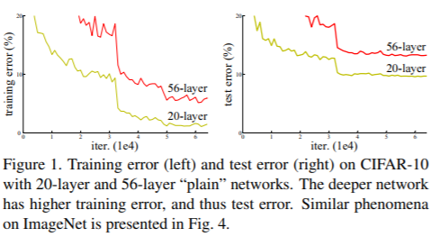
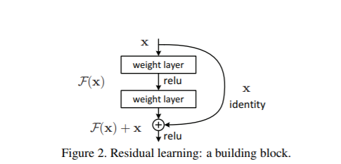

# Deep Residual Learning for Image Recognition
본 논문은 2014 ILSVRC에서 우승한 ResNet을 다룸

## Abstract
ResNet의 주된 특징  

- `residual learning framework` 제시
    - optimize 하기 쉬움
    - depth가 깊어져도 accuracy를 얻을 수 있음
- 152의 layer
    - VGG Net 보다 8배 깊은 모델
    - VGG Net 보다 complexity 적음
- ImageNet에서 3.57% 오류율 달성

## Introduction
model의 depth가 깊어지면 성능이 좋아진다고 여김  
- 의문점 : layer을 더 쌓을수록 network가 더 잘 학습할까?
    - depth가 깊어짐에 따라 gradient vanishing/exploding 문제 발생
    - 이 문제는 normalization을 통해 해결해 옴

deeper network는 `Degradation` 현상 발생
> `Degradation`은 layer가 깊어질 수록 accuracy가 증가하지 않고 감소하는 현상
- overfitting에 의한 문제는 아님

`Degradation Problem`의 해결책으로 `deep residual learning` 도입

기존 네트워크의 output을 $H(x)$ 라 할 때  
입력에 대응되는 $F(x)$를 $H(x) - x$로 정의하고  
$H(x)$를 기존 네트워크에 입력값 $x$ 를 더한 형태인 $F(x) + x$로 만듦
이와 같은 형태를 `Shortcut connections`이라 명명  

이에 대한 효과는  
- 기본 함수를 잔차를 0으로 만드는 방향으로 만듦
- optimze 하기가 더 쉬움

## Related Work
ResNet의 장점을 설명하고 있음

## Deep Residual Learning
### Residual Learning
한 가정은 기존 $H(x)$를 $F(x) := H(x) -x$식을 써 $F(x) + x$로 근사하는 방법이 더 낫다고 말함

### Identity Mapping by Shortcuts
$$ y = F(x, {W_i}) + x $$
- 위의 식을 간단히 하기 위해 bias 생략
- $F(x, {W_i})$는 $ W_2 \sigma(W_1x) $로, $\sigma$는 relu 함수를 의미
- 둘의 dimension이 동일 할 때 위의 식을 씀

$$ y = F(x, {W_i}) + W_sx $$
- 둘의 dimension이 동일하지 않을 때 위의 식을 씀
- linear projection을 사용해 dimension을 통일 시킴
- $W_s$는 dimension을 맞추는 역할

### Network Architectures
#### Plain Network
VGGNet을 참고하여 모델을 만듦

#### Residual Network
Plain Network에 shortcut connection을 추가
- zero padding을 사용해 추가의 parameter 없이 dimension을 통일
- projection 을 사용해 dimension 맞춤

## Experiments
다양한 데이터셋에 plain 모델과 ResNet 모델을 비교
- ResNet이 degradation problem을 잘 조절
- optimize 하기 쉬움

## Reference 
- [[논문 리뷰] Deep Residual Learning for Image Recognition - ResNet(1)](https://jxnjxn.tistory.com/22)