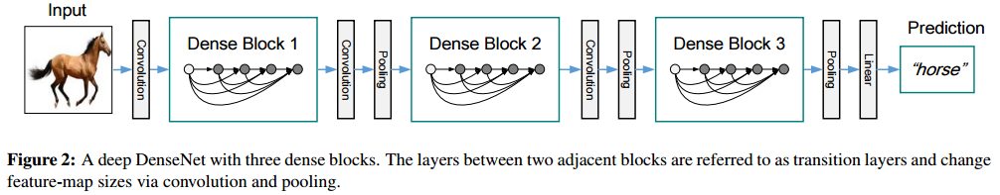

# Densely Connected Convolutional Networks
## Abstract
DenseNets의 장점
1. alleviate the vanishing-gradient problem
2. strengthen feature propagation
3. encourage feature reuse
4. substantially reduce the number of parameters

## Introduction
1. 이전 논문들 short path 사용 (이전 층의 값만 받는 식)
    -  우리는 모든 층을 연결시킴

2. ResNet은 features을 summation 함
    - 우리는 concatenating 함

3. 기존 논문은 $L$개 layer의 결합
    - 우리는 $\frac{L(L+1)}{2}$ 결합
    - 우리 모델은 dense connectivity pattern 때문에 `DenseNet`이라 부름

4. 불필요한 feature-maps을 재학습하지 않음
    - 기존 conv net보다 적은 파라미터 사용
    - ResNet은 identity transformation으로 정보 보존
        - BUT 많은 layer들이 거의 기여를 하지 않고 정보가 radomly drop 됨

5. DenseNet의 layer은 narrow 함
    - filter의 수가 많지 않음
    - collective knowledge를 추가
    - final classifier가 모든 feature-map을 반영하여 결정을 내림

6. 정보 및 gradient 전달이 개선 돼 학습하기 쉬움
    - 각 layer는 손실 함수와 input signal로 부터 gradient에 직접적으로 접근 가능
    
7. dense 연결이 정규화 효과를 가짐
    - overfitting 감소

## DenseNets
### Dense connectivity
ResNet : $x_{\ell} = H_{\ell}(x_{\ell-1}) + x_{\ell-1}$  
DenseNet : $x_{\ell} = H_{\ell}([x_0, x_1, \cdots, x_{\ell-1}])$

더하는 방식이 아닌 concatenate 하여 표현

### Composite function
$H_{\ell}(\cdot)$ : BN + ReLU + 3x3 Conv

### Pooling layers
concat시 feature map의 크기가 다르면 연산이 불가능
- conv network에선 feature map의 down-sampling layer가 필수
    - pooling을 이용해 feature map size를 줄임 
- down-sampling을 용이하게 만들기 위해 multiple Dense Block 으로 나눔
- Dense Block 사이에 transition layer 층을 둠
    - conv와 pooling을 하는 layer
    - BN + 1x1 Conv + 2x2 avg pooling

### Growth rate
DenseNet의 hyper-parameter : $k$
- $k$(growth rate) : $H_{\ell}(\cdot)$ 통과해 나오는 feature map의 개수
- $\ell^{th}$ layer의 input feature map 수 : $k_0 + k * (\ell - 1)$
    - $k_0$ : Dense Block의 input feature map 수
- state-of-art 성능을 냄
    - 각 layer들이 block 내 모든 feature map을 받아 `collective knowledge` 접근
    - feature map을 네트워크의 global state로 볼 수 있음
- Growth rate는 각 layer가 global state에 기여하는 새로운 정보의 양을 조절함

### Bottleneck layers
각 layer는 $k$의 feature map을 출력하지만 입력으론 많은 feature map을 받음
- ResNet과 Inception에서 사용한 3x3 Conv 전 1x1 Conv를 추가하는 bottleneck layer 도입
    - input feature map의 수를 줄여 계산 효율 향상
- DenseNet은 다음과 같이 사용 
    - BN-ReLU-Conv(1x1)-BN-ReLU-Conv(3x3)-$H_{\ell}$
        - Conv(1x1)을 통해 feature map의 크기를 $4k$로 맞춤
        - 이후 Conv(3x3)을 통해 feature map의 크기를 $k$로 맞춤

### Compression
모델의 compactness 향상시키기 위해 사용
- transition layer에서 feature map의 수를 줄임
- Dense Block이 $m$의 feature map을 가질때
- $\lfloor m\theta \rfloor$를 이용해 feature map 조절
    - $0 \leq \theta \leq 1 $는 compression factor 라 함
- $\theta =1$ 일때는 feature map의 크기가 변하지 않음