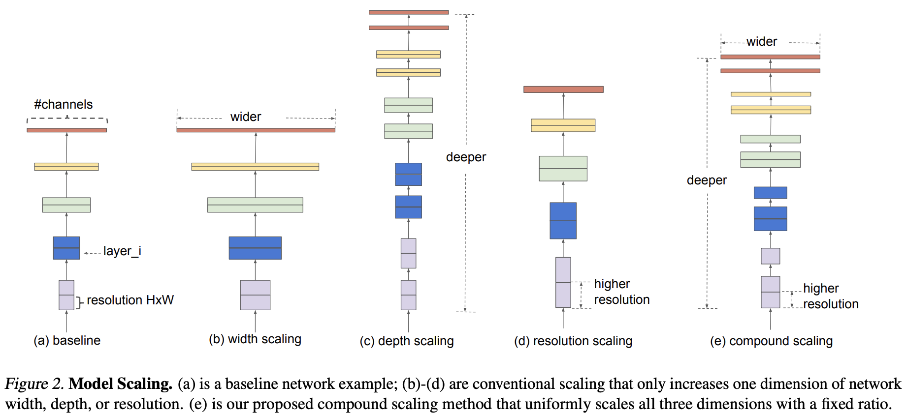
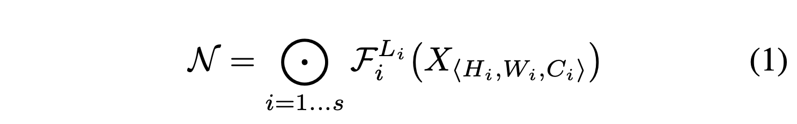
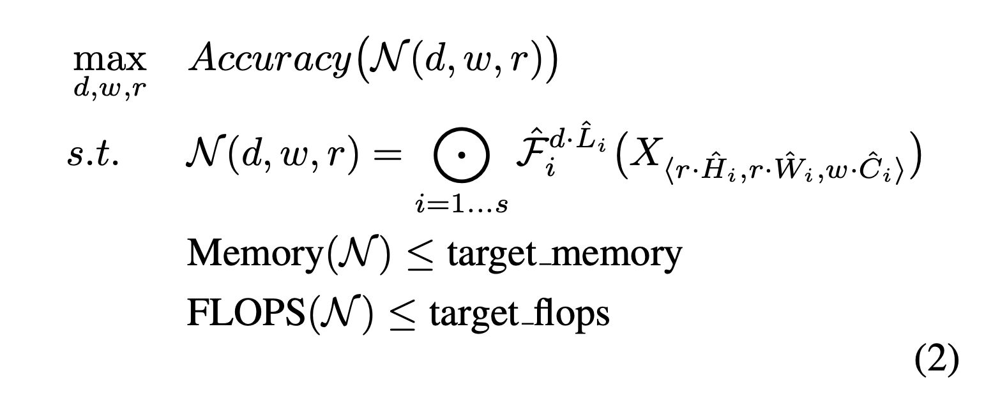
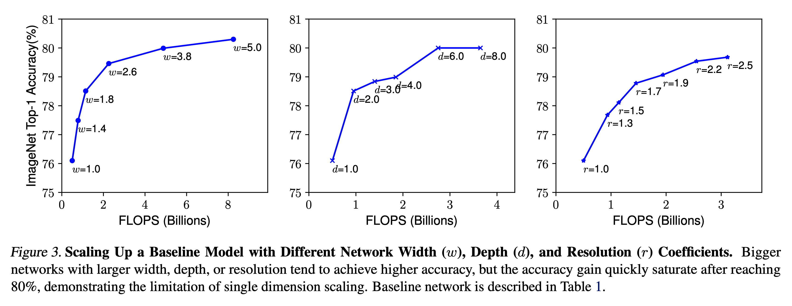
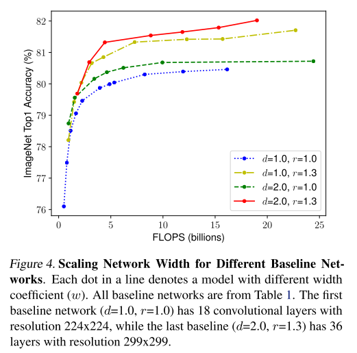
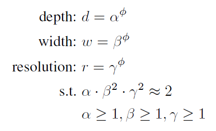
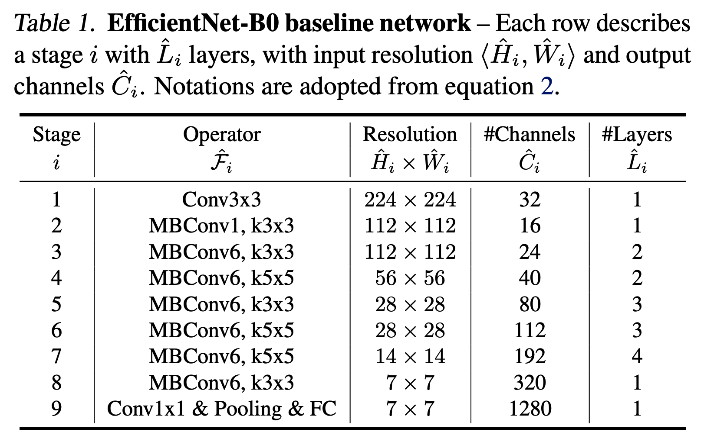
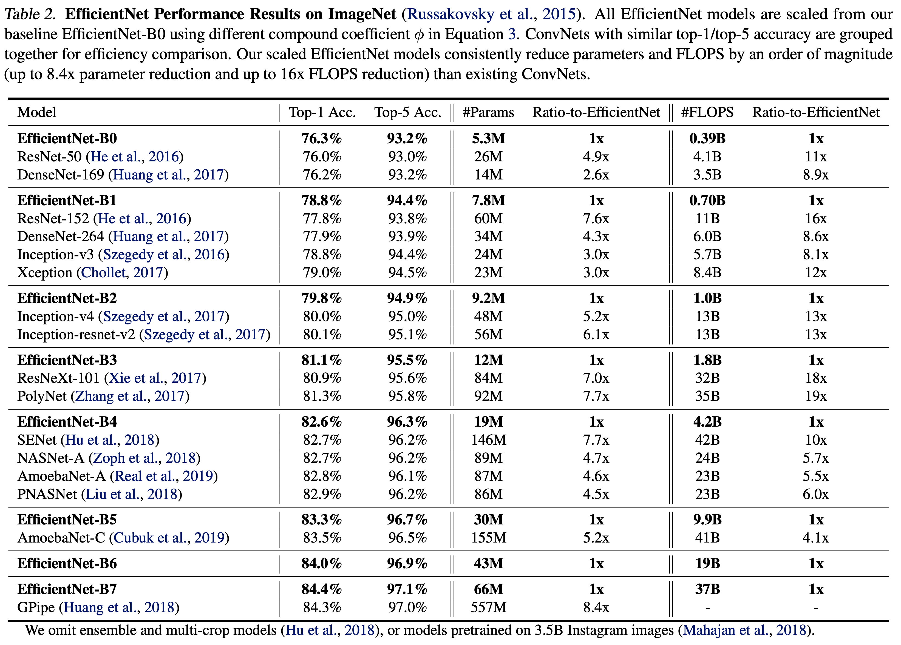
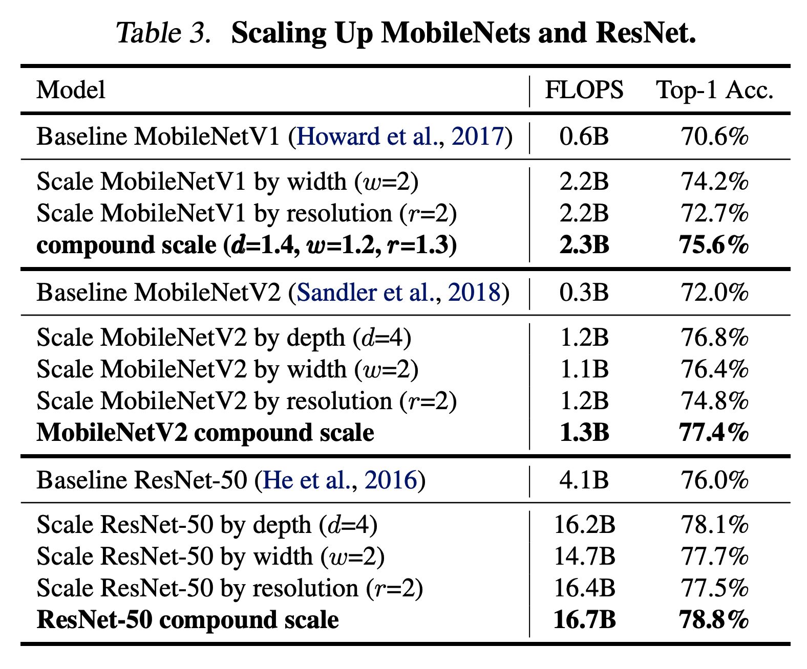

# EfficientNet: Rethinking Model Scaling for Convolutional Neural Networks
## Abstract
- 새로운 스케일링 방법 소개
    - 간단하면서 고효율을 내는 scaling 제시
    - **compound coefficient**
- 새로운 neural architecture 소개
    - **EfficientNets**

## Introduction
기존 모델
- depth를 깊게해 모델 성능 향상
- width를 넓혀 모델 성능 향상
- resoluton을 올려 모델 성능 향상

이전 논문들을 통해 scale up의 중요성 파악
- width와 depth에 대한 상관 관계 제시

**width**, **depth**, **resolution**을 동일하게 scale up method 제시
- compound scaling method
- 임의의 값을 갖고 scaling 하는게 아닌 특정 상수의 값을 이용해 균일하게 scale

- (e) resoultion을 높이고 층을 깊게 만들며 width를 넓힘

## Compound Model Scaling
### Problem Formulation
ConvNet Layer $i$ 는 다음과 같이 정의 할 수 있음
- $Y_i = \mathcal{F}_i(X_i)$
    - $\mathcal(F)_i$는 연산자, $Y_i$는 output tensor, $X_i$는 input tensor
    - $X_i$의 크기는 $< H_i, W_i, C_i >$

다양한 stages로 나눠진 architecture 는 다음과 같이 정의 할 수 있음

- $\mathcal{F}^{L_i}_i$는 $\mathcal{F}$ stage $i$에서 $L_i$번 반복
- 위의 식도 모든 요소들을 고려하기 힘듦

- 위와 같이 간소화
- network의 정확도를 최대화 할 수 있는 coefficient $d, w, r$을 찾는 쪽으로 식 정의

### Scaling Dimensions
각 요소들($d$, $w$, $r$)이 독립적이지 않고 resource 제약 존재
- 한 차원을 제한 해 놓고 scale 함  

위와 같은 실험 진행
- Depth($d$)
    - deep 한 network는 image의 feature를 잘 담아낼 수 있지만 gradient vanishing 문제가 있음
- Width($w$)
    - 대부분의 width를 scale한 모델의 크기는 작음
    - wider 할수록 더 많은 세세한 feature를 담을 수 있음
- Resolution($r$)
    - 높은 resoultion은 잠재적으로 세세한 feature을 담을 수 있음
- 각 요소 값이 클 수록 정확도가 좋지만 특정 지점에서 빠르게 saturate

### Compound Scaling
각 요소들은 독립적이지 않음 
- high resolution을 위해선 큰 모델이 필요(deep depth)
- high resolution의 세세한 feature을 담기 위해선 큰 width가 필요

각 요소들을 변화시켜가며 정확도 비교

- 더 나은 정확도를 얻기 위해선 세 요소의 값을 균형있게 scale 해야 함

- $\alpha, \beta, \gamma$는 고정 상수로 small grid search로 결정
    - depth의 경우 기존의 2배가 되면 FLOPS 역시 2배가 늘어남
    - width와 resolution의 경우 2배가 되면 FLOPS는 4배가 늘어남
    > FLOPS : 컴퓨터 초 당 연산량
- $\phi$는 coefficient 이며 사용자가 정의할 수 있음

## EfficientNet Architecture
모델의 성능은 위의 세 factors 뿐 아니라 baseline network에도 영향을 받음]
- EfficientNet 제시

**EfficientNet**
- MnasNet을 기본으로 만듦
    - 정확도와 FLOPS를 최적화 하여 만듦

다음과 같은 방식을 사용
1. $\phi$를 1로 고정 후 small grid search를 활용해 $\alpha, \beta, \gamma$ 찾음
2. 위의 결과로 찾은 $\alpha, \beta, \gamma$을 고정 한 후 $\phi$를 변화 시켜 찾음
    -  EfficientNet-B1 ~ B7

- 다른 모델보다 좋은 성능을 보이면서 parameter의 수와 FLOPS 에서도 큰 차이를 보임

## Experiments

- MobileNet과 ResNet에 compound scale 적용
- 한 factor만 scale 했을 때 보다 모든 factor을 scale 했을 때 성능이 더 나음

## Conclusion
- width, depth, resolution을 균형있게 조절한 것이 acuuracy와 efficiency 측면에서 좋았음
- mobile size의 EfficientNet을 만들어 적은 parameter와 FLOPS를 이용해 좋은 성능을 냄

## Reference
- [EfficientNet: Rethinking Model Scaling for CNN.](https://norman3.github.io/papers/docs/efficient_net.html)