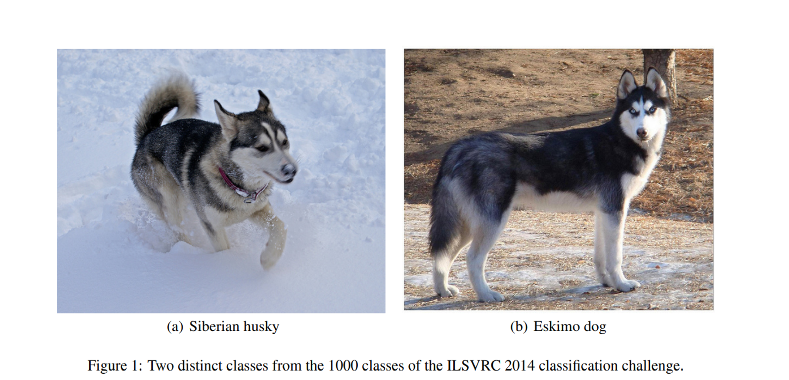
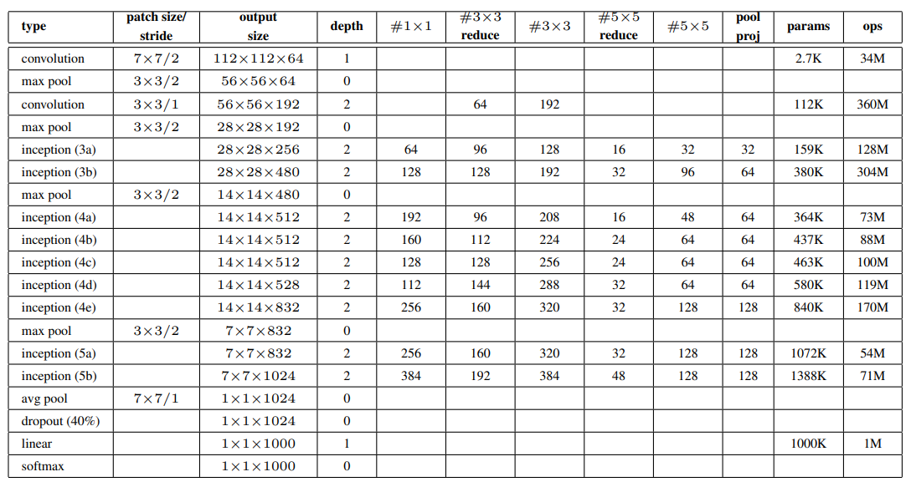

# Going Deeper with Convolutions
본 논문은 2014 ILSVRC에서 우승한 GoogLeNet을 다룸 

## Abstract
GoogLeNet의 주된 특징
- 네트워크 안에서 `computing resources`의 활용성을 향상
- `computational budget`을 유지하며 네트워크의 depth와 width를 확장
    - Hebbian principle & the intuition of multi-scale processing.

## Introduction
### GoogLeNet 이전 모델
AlexNet 모델
- 2012 ILSVRC 우승
- 8개의 layer 사용
- parameter 수 62M

### 딥러닝의 추세
1. stacked conv layers + fc layers(1 or more)
2. layer의 수와 layer size 증가
3. Dropout을 통해 overfitting 방지

GoogLeNet도 추세를 따름
- stacked layers + fc layers
- layer 수 22개, wide한 layer
    - AlexNet 보다 layer의 수가 많음
    - AlexNet 보다 parameter 수 12배 적음
- Dropout 사용
- NIN(Network In Network) 사용

## Related Work
### Network In Network
NIN은 기존 conv layer에 MLP 추가
- 기존 conv layer는 GLM
    - 각 자리의 픽셀과 weight의 곱/합 연산
- conv layer에 MLP 추가
    - 비선형적 관계 표현 증가
- `1x1` 필터 사용
    - `computational bottlenecks` 줄이기 위한 차원 축소의 역할
    - network의 depth와 width를 확장 가능

## Motivation and High Level Considerations
큰 사이즈의 모델은 많은 파라미터가 필요함을 의미
- 제한된 라벨 셋에서는 overfitting 될 수 있음
    - 특히, training data가 전문가가 구분할 정도로 어려운 문제일 때
- 계산량의 증가

위의 문제를 해결하기 위한 방법
- CNN에서 `sparsely connected architectures` 이용
> 데이터를 잘 설명하는 통계적 분포가 존재한다면 층마다 상관이 높은 값들을 clustering

하지만 sparse 한 structure은 하드웨어 계산에서 비효율

그렇다면 그 중간 단계는 없을까?
- sparse matrix를 dense submatrix로 clustering

## Architectural Details
## Inception Architecture 

Inception 주된 idea는 `CNN에서 최적의 local sparse 구조를 어떻게 dense 요소로 근사 하는가?`
- 층 내부에서 상관성이 높은 애들끼리 clustering
- 위의 clustering 값을 다음 층으로 보냄

좀 더 자세히 설명하면  
input과 가까운 값들은 local region의 patch를 많이 생성
- 이것들은 `1x1` 필터에 의해 clustering

좀 더 큰 범위에 애들은 `3x3` 이나 `5x5` 필터로 clustering 됨  
이후 각 cluster를 하나로 묶어 다음 층의 input으로 넘김

그림 (a)의 경우 위의 필터들로만 구성한 모듈
그림 (b)의 경우 `1x1` 필터들을 추가한 모듈

### `1x1` 필터 효과
채널의 수 감소
- `1x1`은 입력 데이터의 국소적인 부분 patch를 생성
- patch들은 비슷한 형태를 띰
- 이들을 clustering 하여 채널 수를 줄임
- 차원 감소
    - bottleneck 감소

최종적인 모델 모습

## Reference
- [Network In Network](https://arxiv.org/pdf/1312.4400.pdf)
- [Inception(GoogLeNet) 리뷰](https://kangbk0120.github.io/articles/2018-01/inception-googlenet-review)
- [Google Inception Model.](https://norman3.github.io/papers/docs/google_inception.html)