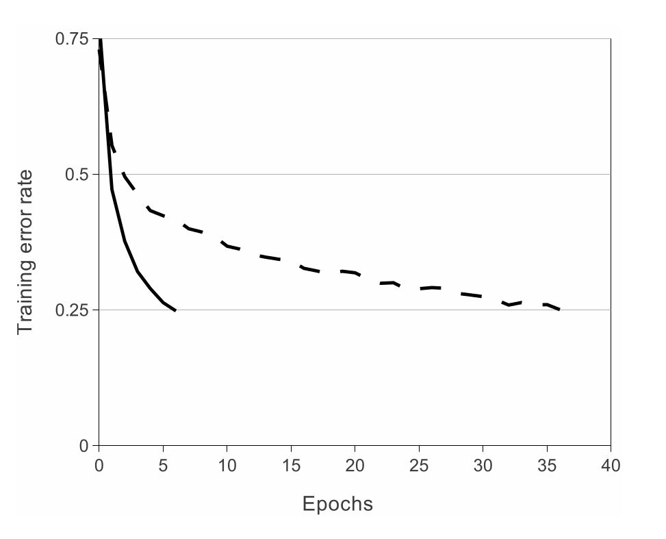
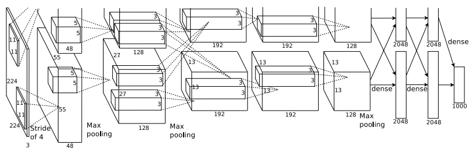

# ImageNet Classification with Deep Convolutional Neural Networks
본 논문은 2012년 ILSVRC 에서 1등을 한 AlexNet을 다룸

## Abstract
AlexNet의 주된 특징
- 5개의 `conv layer`과 `max-pooling layer` 사용
- 3개의 `fc layer` 사용
- 학습을 빠르게 하기 위해 `non-saturating neurons`과 `GPU` 사용
- overfitting을 줄이기위해 `dropout` 사용

## Introduction
- 이미지 처리에 ML 기법들이 많이 사용
- 하지만 GPU의 사용으로 CNN을 이용해 이미지 처리에 적용할 수 있었음
- 후에 기술 할 목록
    1. 성능 향상과 학습 시키기 위한 몇 가지 특징들
    2. overfitting 줄이는 방법

## The Dataset
ImageNet
- 약 22000개의 범주를 갖는 1500만개의 고해상도 이미지 셋

이미지의 크기가 재각각  
- 이미지의 작은 부분을 `256`로 맞춘 후 사진 중앙을 `256x256` 맞춰 crop
- 전처리는 RGB의 평균값을 빼는 정도만 진행

## The Architecture
### ReLU Nonlinearity
일반적인 활성화 함수는 `tanh(x)` 활용
- $tanh(x) = (1 + e^{-x})^{-1}$
- 속도 측면에서 `non-saturating nonlinearity`보다 느림

non-saturating nonlinearity
- Rectified Linear Units(ReLUs)
- $f(x) = max(0, x)$
- 같은 오류율에 도착하는데 Epochs의 수의 차이가 남

### Training on Multiple GPUs
GPU를 사용하여 훈련 시간을 줄임

### Local Response Normalization
$$ b_{x, y}^{i} = a_{x, y}^{i} \, / \left(k + \alpha + \sum_{j=max(0,i-n/2)}^{min(N-1,i+n/2)} (a_{x, y}^{i})^2 \right)^{\beta} $$
- $b_{x, y}^{i}$ : 정규화 된 i번째의 kernel x, y 값
- $a_{x, y}^{i}$ : i번째의 kernel x, y 값
- $n$ : 정규화시 사용할 주위 kernel의 수
- $N$ : 총 kernel 수
- $\alpha$, $\beta$, $k$ : 하이퍼파라미터

여기서 $n$, $\alpha$, $\beta$, $k$ 는 상수
- $n$ = 5, $\alpha$ = $10^{-4}$, $\beta$ = 0.75, $k$ = 2 로 설정

위의 식은 혼자 튀는 값을 억제해 줌
- 이후 ReLU 적용

### Overlapping Pooling
동일한 kernel map에 주변 뉴런들의 output을 요약해줌

### Overall Architecture

2, 4, 5 번째 conv layer은 동일 위치의 GPU의 연결만 받음    
3 번째 conv layer은 2 번째 conv layer의 모든 값과 연결 됨

## Reducing Overfitting
### Data Augmentation
Data Augmentation 진행
- `horizontal reflections` 
- PCA를 활용해 RGB 값을 변경

### Dropout
은닉층의 뉴런 일부를 0 값으로 만듦

## Discussion
CNN 모델이 좋은 결과를 낼 수 있다!!

## Reference
- [[AlexNet] 논문 리뷰 & 구현 (Pytorch)](https://wolfy.tistory.com/241)
- [AlexNet: ImageNet Classification with Deep Convolutional Neural Networks](https://curaai00.tistory.com/4)