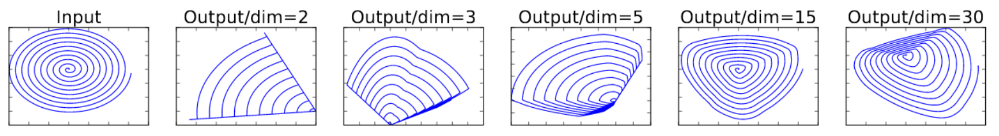
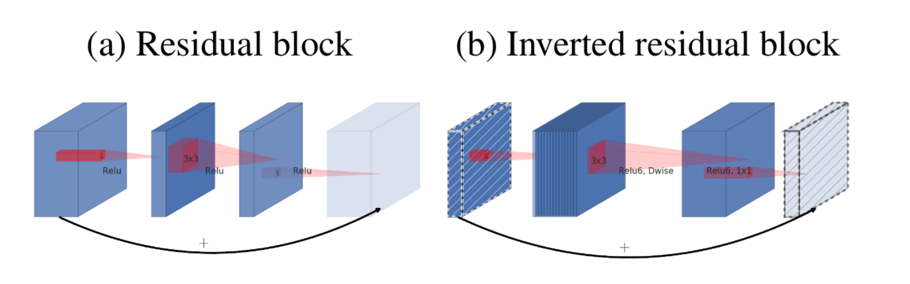

# MobileNetV2: Inverted Residuals and Linear Bottlenecks
## Abstract
- SSDLite
    - framework
    - object detection에 좋은 성능 냄
- Mobile DeepLabv3
    - mobile semantic segmentation model
    - inverted residual structure
        - thin bottleneck layer에 사이에 shortcut 연결
    - intermediate expansion layer
        - 경량 depthwise convolution 사용
            - image의 비선형성 feature 추출
- input과 output의 domain을 분리

## Introduction
mobile과 embedded application에서 연산량은 적으면서 정확도는 비슷한 모델을 원함
- linear bottleneck을 가진 inverted residual module 적용
    - input을 저차원으로 압축해 다시 고차원으로 복원하는 작업

## Preliminaries, discussion and intuition
### Depthwise Separable Convolutions
Depthwise Separable Convolutions
- full conv를 depthwise convolution와 pointwise convolution로 나눔
    - depthwise convolution : input 각 채널에 하나의 필터만 사용해 특징 추출
    - pointwise convolution : input에 `1x1` 필터를 적용해 연산량을 줄이고 채널수를 조절

### Linear Bottlenecks
maniford 가설
- 고차원의 정보를 저차원으로 표현 가능
- ReLU의 역할
    - 저차원으로 맵핑 된 데이터가 양수 값일 때 ReLU는 선형 변환과 동일
        - 정보를 보존 함
    - 정보 손실이 없을 것이다 생각 but 손실 발생

- 차원이 작은 값에선 ReLU를 적용하면 정보 손실 발생
- manifold의 정보를 유지하면서 차원을 줄이는 방법 소개
    - linear bottleneck

### Inverted residuals

- Residual Block 유사하나 차이점이 있음
    - wide - narrow - wide 방식에서 narrow - wide- narrow 방식을 취함
    - 다른 활성화 함수 사용
        - ReLU, ReLU6

## Conclusions
- 고 효율 모바일 모델을 만듦

## Reference
- [MobileNetV2(모바일넷 v2), Inverted Residuals and Linear Bottlenecks](https://gaussian37.github.io/dl-concept-mobilenet_v2/)