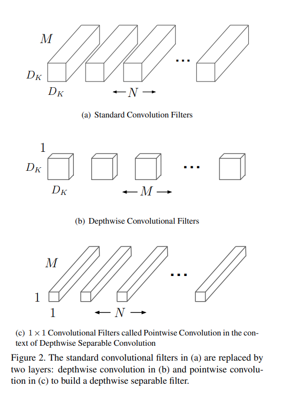
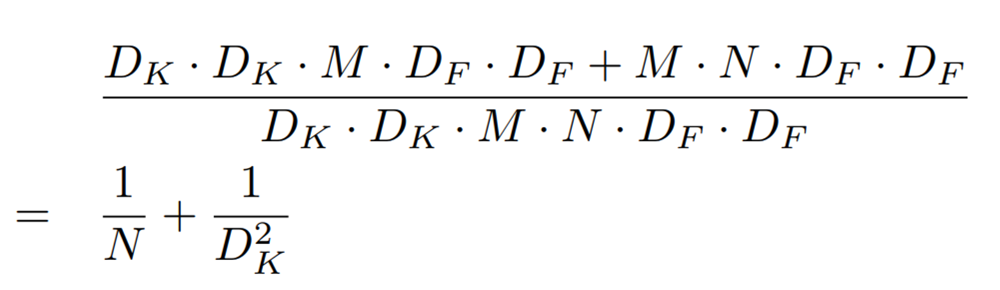
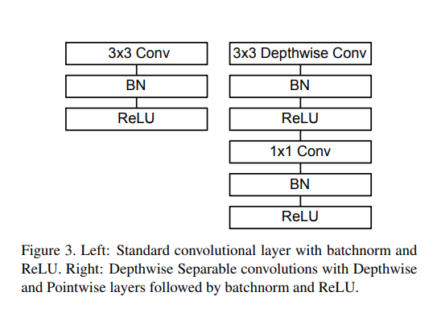
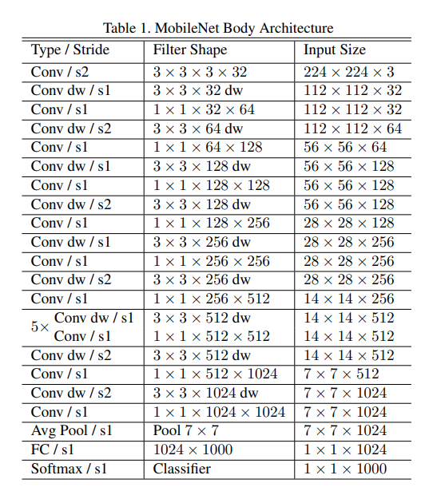
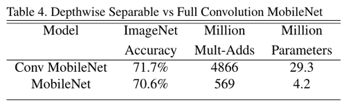
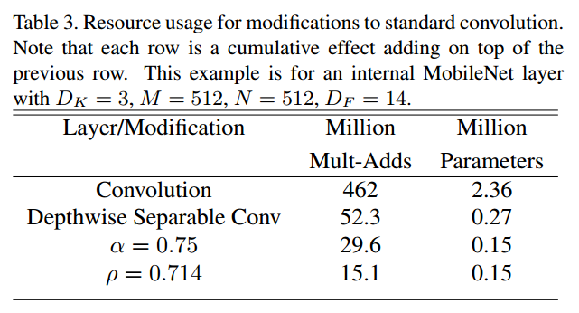
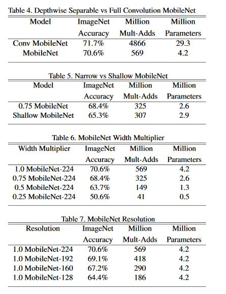
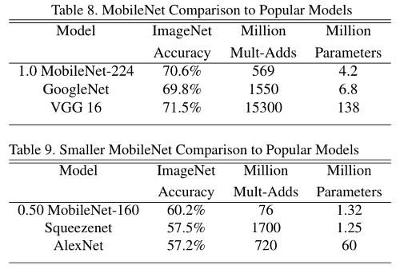

# MobileNets: Efficient Convolutional Neural Networks for Mobile Vision Applications
## Abstract
MobileNets
- mobile과 embedded vision application 을 위해 만듦
    -  depthwise separable convolutions 사용
- global hyperparameter 소개
    - 제한된 자원에서 적절한 size model을 찾아줌

## Introduction
1. mobile과 embedded vision application에 적합한 architecture 소개
2. hyper-parameter 소개
    - width multiplier
    - resolution multiplier

## MobileNet Architecture
### Depthwise Separable Convolution
standard convolution을 나눔
- depthwise convolution
- pointwise convolution

(a) Standard Convolutional filters
- input($D_F$, $D_F$, $M$) 이미지에 ($D_K$, $D_K$, $M$)의 필터를 적용 해 $N$개의 channel 생성
- feature 추출과 함께 channel의 수도 조절
- computational cost : $D_K \cdot D_K \cdot M \cdot N \cdot D_F \cdot D_F$

(b) Depthwise Convolutional Filters
- input($D_F$, $D_F$, $M$) 이미지에 ($D_K$, $D_K$, 1)의 필터를 적용 해 $M$개의 channel 생성
- feature 추출만 이루어짐
- computational cost : $D_K \cdot D_K \cdot M \cdot D_F \cdot D_F$

(c) Pointwise Convolution
- input($D_F$, $D_F$, $M$) 이미지에 (1, 1, $M$)의 필터를 적용 헤 $N$개의 channel 생성
- 이미지의 channel 수를 조절
- computational cost : $M \cdot N \cdot D_F \cdot D_F$

standard와 나머지 둘 간 cocmputational cost를 비교하면

- 분리 결합 시 위와 같은 computational reduction 발생

### Network Structure

- 마지막 layer을 제외한 모든 layer은 Batch Norm과 ReLU 적용
- Depthwise Separable 모듈 사용
    - `3x3` Depthwise conv 와 `1x1` point wise conv 사용

### Width Multiplier: Thinner Models
width multiplier $\alpha$
- layer을 thin 하게 만듦
- $\alpha \in  (0, 1]$의 값을 $M$과 $N$에 곱해 줌

- dw : depthwise sperable convolution

parameter가 급격히 감소

### Resolution Multiplier: Reduced Representation
resolution multiplier $\rho$
- $\rho \in  (0, 1]$의 값을 $D_F$에 곱해 줌

parameter의 감소를 보임

## Experiments

- Table 4. standard conv와 depthwise separable conv 비교
    - 정확도 면에서 조금 떨어지지만 parameter와 연산량이 확연히 줄어듦
- Table 5. thin과 shallow 비교
    - thin model이 정확도가 더 높고 parameter의 수는 더 낮음
    - 깊이를 줄이는 것 보다 이미지의 크기를 줄이는게 더 효과적
- Table 6. $\alpha$ 비교
    - $alpha$를 줄이면 parameter의 수가 감소한 만큼 정확도도 낮아짐
- Table 7. $\rho$ 비교
    - $\rho$를 줄이면 정확도가 감소

- alpha$와 $\rho$를 적용하지 않았을 때도 적은 parameter로 준수한 정확도를 보임
- alpha$와 $\rho$를 적용 했을 경우 parameter의 수가 적으면서 다른 모델보다 정확도가 높음

## Conclusion
MobileNet
- depthwise separable convolution 기반한 모델
- 더 작고 빠른 모델을 만들기 위해 hyperparameter 사용
    - width multiplier
    - resoultion multiplier
    - 정확도에서 손실을 보지만 model의 size와 latency를 확연히 줄일 수 있음

## Reference
- [MobileNets - Efficient Convolutional Neural Networks for Mobile Vision Applications](https://gaussian37.github.io/dl-concept-mobilenet/)