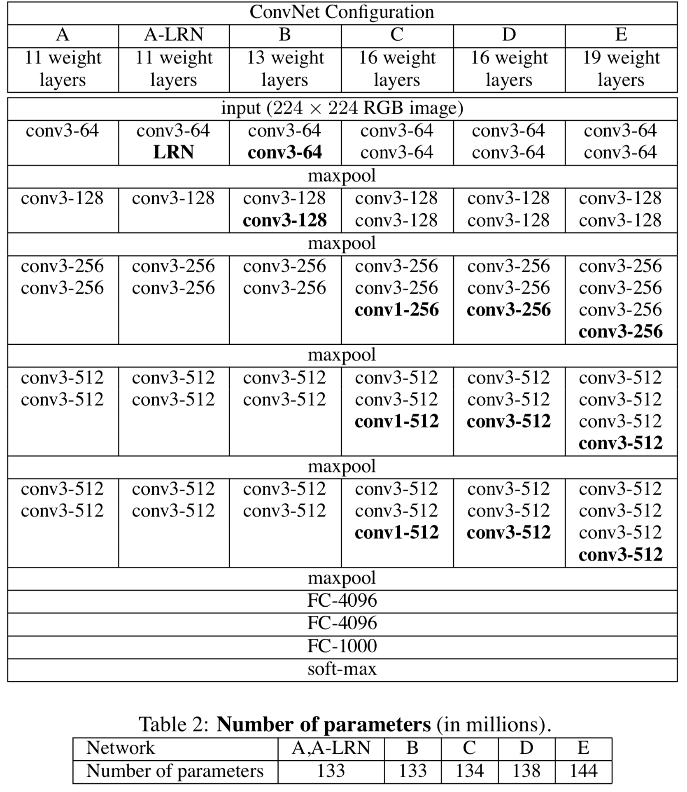

# Very Deep Convolutional Networks for Large-Scale Image Recognition
본 논문은 2014년 ILSVRC에서 준우승한 모델인 **VggNet**을 다룸

## Abstract
VGGNet의 특징
1. 3 x 3 필터 사용
2. 16-19개의 weight layer 사용

기존의 CNN 모델의 경우 깊은 layer을 사용하지 않음
반면 VGGNet은 layer의 개수를 늘리고 고정적으로 3 x 3 필터 사용해 정확도 높임

## Introduction
ConvNet의 깊이에 대해 신경 씀  
또한 `3x3` 필터 사용

## ConvNet Configurations
### Architecture
ConvNet의 input size를 RGB `224x224` 이미지로 고정
- 전처리는 RGB 평균값만 빼줌 

입력값을 `conv`층을 통과 시킴
- 필터의 크기는 `3x3`
- stride `1`pixel로 고정
- padding `1`pixel

`Maxpooling` 층을 통과 시킴
- `2x2`pixel window
- stride `2`

3개의 `Fully-Connected` layers
- 첫 번째와 두 번째 층은 `4096` channels
- 마지막 층은 `1000` channels

모든 `hidden` layers은 `ReLU`를 사용
- `Local Response Normalisation` 적용하지 않음

### Configurations
실험한 모델은 depth만 달리함
- depth가 달라졌지만 파라미터의 수는 큰 차이가 없음

### Discussion
이전 모델은 `11x11` 또는 `7x7`의 필터를 사용
- VGGNet의 경우 `3x3` 필터를 여러번 이어 붙임
- `3x3` 필터를 3번 쌓으면 `7x7`만큼 효과적인 수용장을 만들 수 있음

`3x3` 필터의 사용 이유
- 3개의 비선형 층을 사용해 결정 함수가 더 잘 구분하게 만듦
- 파라미터의 수를 줄일 수 있음
    - `7x7` 필터 weight : $7^2C^2 = 49C^2$ 
    - `3x3` 필터 3개 weight : $3(3^2C^2) = 27C^2$ 

## Classification Framwork
### Training
AlexNet에서 사용한 기법 사용
- 이미지를 horizontal flip, RBG color shift 사용

이미지를 특정 방식에 따라 rescale해서 crop
- 이미지의 width와 height 중 작은 쪽을 `S`라 명명
    - 1. S를 `256` 또는 `384`에 맞춤
    - 2. S를 [256, 512] 사이의 값으로 랜덤하게 rescale

### Testing
이미지의 width와 height 중 작은 쪽을 `Q`라 명명
- 이미지를 다양한 사이즈로 rescale하여 crop
- horizontal flip 적용

## Conclusion
depth가 커지만 accuracy에 영향을 줌

## Reference
- [[논문 리뷰] VGGNet(2014) 리뷰와 파이토치 구현](https://deep-learning-study.tistory.com/398)