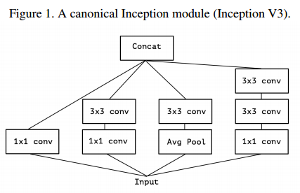
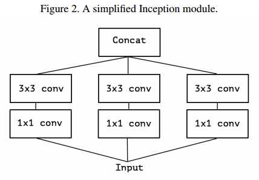
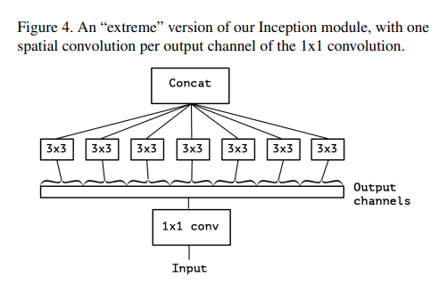

# Xception: Deep Learning with Depthwise Separable Convolutions
## Abstract
Inception module
- regular convolution과 depthwise separable convolution의 중간
- Inception V3와 parameter의 수가 비슷하지만 성능이 좋음
    - capacity 증가가 아닌 모델 parameter을 효율적으로 사용했음을 시사

## Introduction
Inception 계열의 네트워크는 input에 대해 conv를 펼쳐 계산해 concat 해 다음 layer로 넘김  
그 중 좋은 결과를 낸 모델이 Incpetion-V3이며 보편적인 형태는 다음과 같음

Inception module은 conv와 흡사하지만 적은 parameter로 풍부한 features 학습할 수 있음
1. Inception module이 어떻게 작동?
2. 기존 conv와 어떻게 다름?
3. 향후 design 전략

## The Inception hypothesis
Inception module 기본 idea
- cross-channel correlation과 spatial correlation 동시 mapping을 분리
    - `1x1` conv를 사용해 cross-channel correlation 학습
    - 이후에 `3x3` or `5x5` conv를 사용해 spatial correlation 학습

## The continuum between convolutions and separable convolutions
위의 가설을 극단적으로 표현하면 다음과 같음
- input data를 `1x1` conv 수행 후 `3x3`의 conv 진행

depthwise separable convolution과 유사하지만 차이점이 존재
1. 연산 순서
    - depthwise separable convolution의 경우 channel-wise spatial convolution 수행 후 `1x1` conv 진행
    - extreme version은 `1x1` conv 수행 후 channel-wise spatial convolution 진행
2. 비선형 활성화 함수 적용 여부
    - depthwise separable convolution 적용하지 않음
    - extreme version은 적용

## The Xception architecture
Xception(Extreme Inception)
- cross-channel correlation과 spatial correlation을 완벽히 분리
- 36개의 layer가 존재하며 14개의 모듈로 구조화 됨
- 또한 첫번째와 마지막 모듈을 제외하고 linear residual connection이 존재

## Reference
- [08 Xception: Deep Learning with Depthwise Separable Convolutions](https://wikidocs.net/122179)