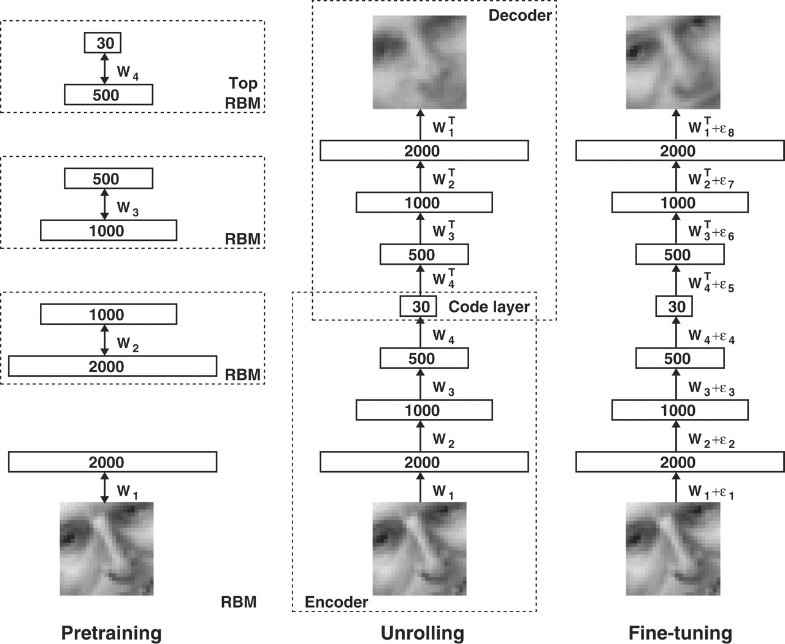

# Reducing the dimensionality of data with neural networks
**Autoencoder**
- 고차원의 데이터를 축소해 원래 차원의 데이터로 변환
    - 데이터를 압축 하는 과정을 encoder라 함
    - 데이터를 복원하는 과정을 decoder라 함
- gradient descent를 사용하면 fine-tuning이 가능함
    - 하지만 가중치의 initializing이 중요
    

