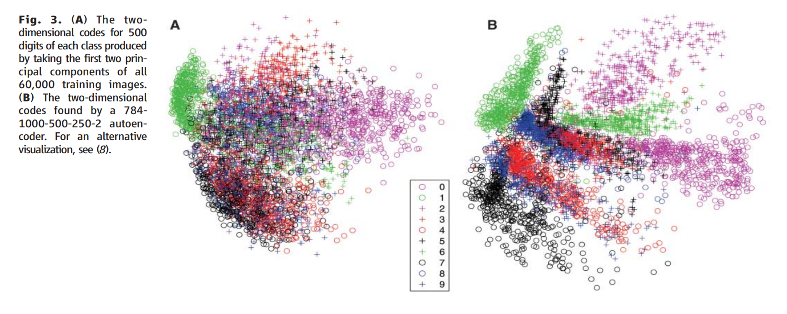
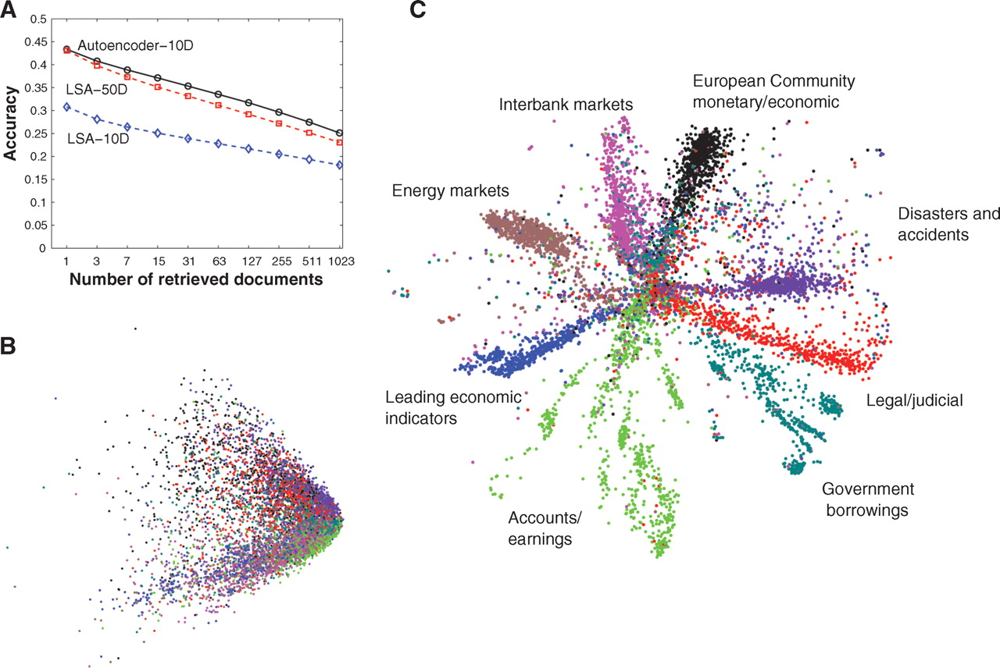

# Reducing the dimensionality of data with neural networks
**Autoencoder**
- 고차원의 데이터를 축소해 원래 차원의 데이터로 변환
    - 데이터를 압축 하는 과정을 encoder라 함
    - 데이터를 복원하는 과정을 decoder라 함
- gradient descent를 사용하면 fine-tuning이 가능함
    - 하지만 가중치의 initializing이 중요
        - 초기 가중치가 크면 local minima에 빠짐
        - 초기 가중치가 작으면 초기 layer의 그레디언트가 작아 hidden layer가 많은 오토 인코더를 훈련할 수 없음

- RBM 모델을 활용해서 여러 층의 값을 만듦
- 이를 unrolled 하여 autoencoder를 만들고 역전파를 이용해 미세 조정함

여기서 우리는 Engery Function의 가중치들을 잘 초기화 해야함  
이 에너지 함수를 통해 각각의 확률을 할당함
- 훈련 이미지의 확률은 에너지를 조절하여 크게 만들 수 있음
    - 가중치와 bias 조정

각 weight는 실제 데이터와 복원 된 값의 차이에 learning rate를 곱해 변경함  
또한 각각의 층들이 layer-by-layer로 연결 돼 있음
- 앞의 feature detector를 다음 layer로 넘길 수 있음
- weight를 적절하게 초기화 가능

PCA vs AutoEncoder
- AutoEncoder의 경우가 데이터에 latent에 대해 더 잘 분리함

LSA vs AutoEncoder
- AutoEncoder의 경우가 latent를 잘 나누며 정확도 면에서도 좋음

AutoEncoder 
- time과 space에 선형적 증가로 Data set이 충분히 커도 사용 가능
- weight 초기화는 성능을 내는데 좋음