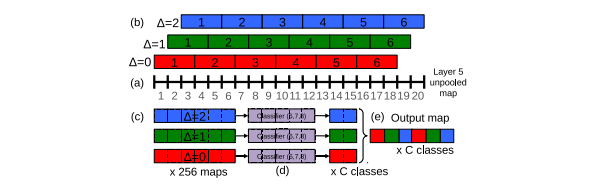
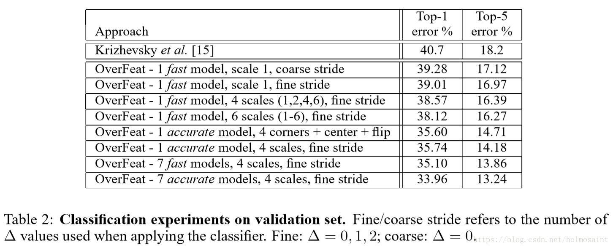
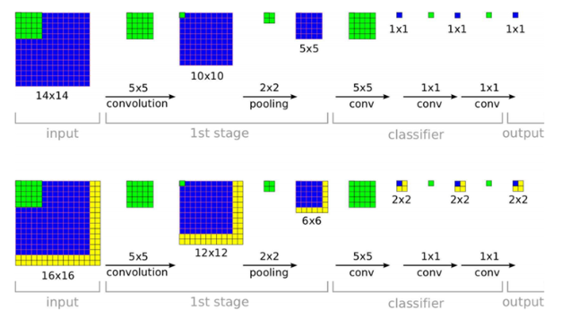

# OverFeat: Integrated Recognition, Localization and Detection using Convolutional Networks
## Abstract
1. Multiscale과 sliding window 접근이 ConvNet에서 얼머나 효율적인지를 밝힘  
2. Object boundaries 학습을 통해 localization에 대한 새로운 접근을 밝힘  
    - Bounding box를 누적시킴
3. single shared network를 사용해 다른 작업을 동시해 학습시킴

## Introduction
논문에서 제안하는 점
1. bounding box 누적시킨 새로운 접근 방법 제안
2. time-consuming과 복잡한 bootstrapping training 방지
    - 많은 localization predictions을 결합 함

## Vision Tasks
1. Classification
    - 각 이미지에 해당 하는 label이 존재, 5번의 추측을 통해 정답을 맞추는 방식

2. Localization task
    - 이미지당 5번의 추측이 가능하며, object의 bounding box를 맞추는 방식

3. Detection
    - 이미지 속에 0개 또는 그 이상의 object를 찾아내는 것

## Classification
### Multi-Scale Classification
Multi-view voting 사용
- 10개의 views 사용(이미지의 코너, 중앙 random crop + crop된 이미지 horizontal flip)
- 이미지의 많은 부분을 무시하고 겹치는 부분을 반복 학습하며 연산량이 증가 함

Multi-scale dense evaluation

위의 사진은 이해를 돕기위해 1차원의 그림으로 나타 냄
- (a)는 fc layer을 거치기 전 map의 크기
- (b)는 20의 크기를 3의 크기로 0, 1, 2 만큼 sliding 진행
- (c)는 (b)에서 만들어진 각각의 map의 개수들
- (d) (c)에서 생성 된 map을 5의 크기 map을 통해 sliding 진행, class 별 socre C를 얻음
- (e)는 (d)에서 생성 된 map을 6의 크기로 변환

### Result

- single scale보단 multi-scale의 성능이 좋음
- sliding 한 경우가 안 한 경우보다 좋음
- fast 모델보다 accuracy 모델의 성능이 더 좋음

### ConvNets and Sliding Window Efficiency

- training의 경우 `1x1` 크기의 이미지를 생성
- test의 경우 큰 이미지에 대해 scaling을 이용해 image를 `2x2` 크기로 생성
    - 시간은 좀 더 걸리지만 이미지의 특징을 더 잡아낼 수 있음

## Localization
### Generating Predictions
classfication에서 학습 한 모델을 바탕으로 classifier layer을 regression layer로 변경
- class에 대한 confidence 값을 생성

### Regressor Training
regression network는 layer 5 에서 feature map을 입력으로 받음
- bounding box의 모서리에 해당하는 좌표를 생성

예측값과 ground-truth 값을 비교해 regressor 학습
- ground-truth와 50% 미만으로 겹치는 박스는 학습하지 않음

### Combining Predictions
1. 이미지에 대해 top k개에 대한 class 할당
    - 이미지 스케일을 6개로 만듦
2. 각 클래스에 대한 bounding box를 각 스케일마다 confidence 예측
3. 각각의 bounding box에 대한 거리와 겹치는 부분의 거리를 최소로 하는 box를 구함
4. 거리를 최소로하며 confidence가 50% 이상인 부분의 box 들을 합침
5. 낮은 confidence의 값은 없앰

## Detection
classification 모델의 weight를 공유
- object가 없는 경우에는 negative example로 학습

ILSVRC13 competition에서 오류율이 낮으면서 높은 mAP를 얻음

## Discussion
1. multi-scale, sliding window 접근을 ConvNet에 효과적으로 선보임
2. 개선 될 여지가 있음
    - back propping 사용
    - L2 손실 대신 IOU 최적화
    - bounding box 매개 변수화

## Reference
- [Paper Review - Object Detection 2 (OverFeat: Integrated Recognition, Localization and Detection using Convolutional Networks)](https://wujincheon.github.io/wujincheon.github.io/deep%20learning/2019/02/15/overfeat.html)