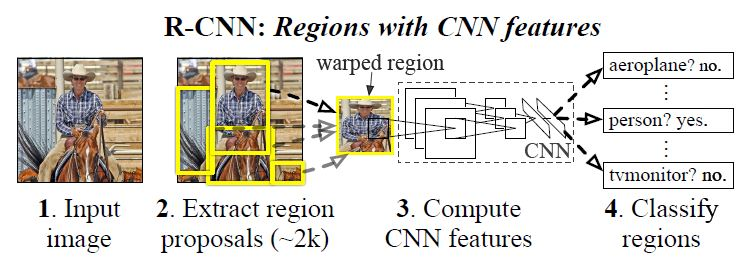

# Rich Feature Hierarchies for Accurate Object Detection and Semantic Segmentation
## Abstract
이전 모델보다 mAP를 30% 이상의 성능 향상
- 모델이 간단하면서 확장성이 높음

주된 insight
- localize와 segment object를 위해 bottom-up region에 ConvNet 적용
- domain-specific fine-tuning

## Introduction
기존 visual recognition tasks은 SIFT와 HOG을 사용  

backpropagation 이용한 SGD가 CNN을 효율적으로 사용할 수 있게 됨  
- CNN을 이용하여 object detection에 큰 성능 향상을 보임

CNN을 활용해 모델 생성  
두 가지 문제에 초점을 둠
1. Deep Network를 활용한 localizing objects
    - recognition using regions
2. 적은 양의 데이터로 high-capacity 모델 학습
    - ILSVRC 데이터를 학습시킨 후 PASCAL fine-tuning

R-CNN 알고리즘

1. 이미지를 입력 받음
2. 2000개의 region proposals 추출
    - warping을 통해 정사각형의 이미지로 변환
3. CNN을 이용해 region proposals의 feature 계산
4. 선형 SVM을 이용해 class 분류

## Object detection with R-CNN
R-CNN은 세 가지의 모듈로 구성 됨
- category-independent region proposals 생성 모듈 
- region에서 고정된 feature vector를 추출하는 CNN 모듈
- 분류를 위한 SVM 모듈

### Module design
1. Region proposals
    - selective search 사용
    > 1. 이미지 초기 세그먼트를 정하여 수많은 region 생성
    > 2. greedy 알고리즘을 사용해 각 region을 기준으로 유사한 부분을 병합
    > 3. 병합된 하나의 큰 부분을 region proposal로 제안

2. Feature extraction
    -  CNN을 사용해 region proposal로 부터 4096차원의 vector 추출
        - 5 개의 Conv layer와 2 개의 fc layer로 구성
        - region proposal을 CNN의 input으로 넣기 위해 고정 된 크기로 줄임

### Test-time detection
- Test 과정
    1. selective search를 통해 약 2000개의 region proposals을 얻음
    2. proposals을 warp 시키고 features을 계산하기 위해 CNN 에 넣음
    3. 각 class에 대해 score를 구함
    4. 모든 이미지에 대해 score가 정해지면 greedy NMS(non-maximum suppression) 적용
        - score가 높은 region과 지정한 threshold 보다 큰 IoU의 region은 선택하지 않음
        > - NMS(non-maximum suppression)  
        >   1. 예측한 bounding box들의 예측 점수를 내림 차순으로 정리
        >   2. 높은 점수의 박스부터 시작하여 나머지 박스들 간 IoU 계산
        >   3. IoU 값이 지정한 threshold보다 높은 박스 제거
        >   4. 최적의 박스만 남을 때 까지 위 과정 반복  
        > 
        > - IoU(inter-section-over-union)   
        >   두 이미지의 겹치는 부분(교집합) / 두 이미지를 합친 부분(합집합)

- Run-time analysis
    - 모든 CNN의 파라미터가 모든 카테고리에 공유 됨
    - CNN에 의해 계산된 feature vectors는 low-dimensional

### Training
1. Supervised pre-training
    - ILSVRC2012 데이터 셋으로 pre-train 시킴

2. Domain-specific fine-tuning
    - warped region proposals만 사용해 SGD 방식으로 CNN의 파라미터를 업데이트
    - CNN의 1000-way 분류기를 N(데이터의 class 개수) + 1(배경)-way 분류기로 만듦
    - 이때 IoU가 0.5 이상인 값을 positive로 미만인 값을 negative로 분류
    
3. Object category classifiers
    - object detection에서 threshold에 따라 mAP가 변함
        - threshold가 0.3일때가 성능이 좋았음

## Visualization, ablation, and modes of error
### Visualizing learned features
<image src='image/top_region.jpeg'>

- non-parametric method 이용해 위의 사진과 같이 나타냄
- 각 row는 그림에 있는 특징들을 가지고 분류

### Ablation studies
<image src='image/fc_layers.png'>

1. Performance layer-by-layer, without fine-tuning
    - 1 ~ 3번째 row를 보면 7 번째 fc layer가 6 번째 fc layer보다 성능이 안 좋음
    - 하지만 7번째 fc layer와 pool layer를 비교하면 파라미터의 수는 확 줄지만 mAP는 감소시키지 않음
    - CNN의 power를 볼 수 있음

2. Performance layer-by-layer, with fine-tuning
    - fine-tuning을 통해 mAP가 증가함
    - 도메인별 학습이 성능의 개선을 이끔

### Network architectures
Network 구조를 어떤 것을 쓰느냐에 따라 성능 차이가 존재
- AlexNet보다 VGGNet의 성능이 더 좋음

### Bounding-box regression
localization error를 줄이기 위해 사용
- SVM 후 클래스별 점수 산출
- Bounding-box regression을 이용해 새로운 bounding box 예측
    - 실제 값과 예측값의 차이를 각 크기로 나눠 주고 이를 선형 변환한 예측값과의 차이를 구함
    - 정규화 term을 넣은 Ridge 회귀를 통해 둘 간 차이를 줄여주는 $w$ 학습

## Conclusion
논문의 insight
1. bottom-up region proposals
2. supervised pre-training and domain-specific finetuning

## reference
- [R-CNN(Regions with CNN features) 논문 리뷰](https://jaehyeongan.github.io/2019/10/10/R-CNN/)
- [[논문읽기]04.R-CNN : Rich Feature Hierarchies for Accurate Object Detection and Semantic Segmentation Tech report](https://leechamin.tistory.com/211)