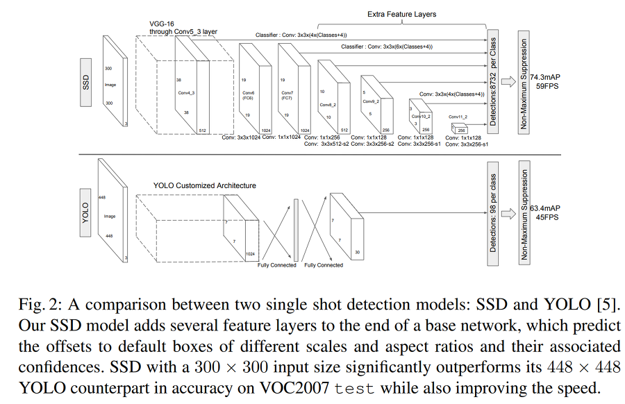
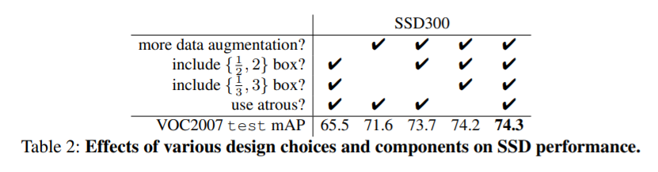

# SSD: Single Shot MultiBox Detector
## Introduction
- 최신 Detection model은 bbox를 찾고 분류기를 사용하는 방식
    - 연산량이 많아 속도가 떨어짐
- 작은 conv layer 필터 사용
    - resampling과 bbox proposal 하지 않음
    - 속도와 성능 두마리 토끼 잡음

## The Single Shot Detector (SSD)
### Model

- SSD는 feed-forward convolutional network 기반
    - bbox와 score 반환
- 기존 CNN모델(base network)에 추가적인 구조 덧붙임
    - fc layer을 conv layer로 바꾸고 추가적인 구조를 붙임 
    - 추가적인 구조는 서로 다른 크기의 feature map을 만들고 bbox와 score 예측
- 다양한 크기의 bbox 생성해 class 예측
    - default box

## Experimental Results
- 다른 모델들보다 빠르면서 성능도 좋음

### Model analysis

- data augmentation이 중요
- 다양한 default box 사용이 중요
- atrous가 빠름
- 여러 feature map을 사용하는 것이 좋음

## Conclusions
- SSD는 단일 feature map이 아닌 multi-scale feature map 사용
- single deep neural network 사용
- 속도와 성능 모두 준수 