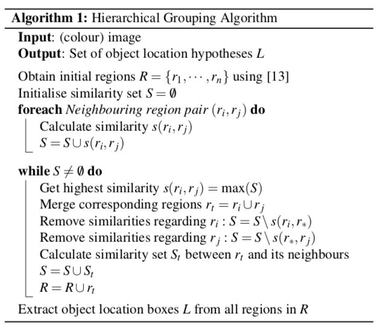
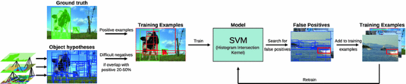

# Selective search for object recognition
## Abstract
Selective Search
- exhaustive search와 segmentation의 장점을 결합한 기법

## Introduction
single strategy을 사용한 해결책 없을 수 있음
- 사물을 하나의 방식으로만 구분하기 힘듦
- 다양한 전략을 사용해야함
- 사전 정보가 필요

Exhaustive Search
- 이미지 내에 물체가 존재 할만한 위치를 모두 잡아냄
- 하지만 다양한 크기와 비율의 사물들을 모두 잡아내긴 힘듦
    - 사전 정보를 활용하지 않음

Segmentation
- 데이터 특성에 기반해 object를 찾는 방식
    - 사전 정보 활용
    - 모든 object에 적용할 수 있는 Segmentation 만드는 것은 힘듦 

Selective Search
- 이미지 구조를 활용해 object 위치 생성
    - bottom-up segmentation
- 가능한 object의 위치를 capture

## Selective Search
고려사항
- Capture All Scales
    - 물체의 크기가 모두 다름
        - 어떤 물체의 경계는 명확하지 않을 수 있음
        - 다양한 scale을 고려해야 함

- Diversification
    - 단일 전략으로 물체를 판단하기 어려움
        - 다양한 전략을 이용

- Fast to Compute
    - 실용적 목적을 위해 계산적 병목 현상이 없게 해야 함

### Selective Search by Hierarchical Grouping

1. Segmentation을 통해 초기 영역을 설정
2. 인접한 모든 영역들 간의 유사도를 구함
3. 전체 영역에서 가장 높은 유사도를 갖는 영역을 병합 후 다시 유사도를 구함
4. 새롭게 구해진 영영을 기존 영역에 추가
5. 전체 영역이 하나의 통합 된 영역이 될 때까지 반복

## Object Recognition using Selective Search

1. positive learning examples로 ground truth 사용
2. negative learning examples로 ground truth와 20~50% 겹치는 부분을 사용
3. SVM 학습
4. SVM 결과 중 false positive를 찾고 negative examples에 추가
5. SVM fine-tuning

## Reference
- [Selective Search 논문 리뷰 및 요약](https://mainpower4309.tistory.com/27)
- [[Part Ⅶ. Semantic Segmentation] 2. Selective Search [3] - 라온피플 머신러닝 아카데미 -](https://blog.naver.com/laonple/220930954658)
- [[Part Ⅶ. Semantic Segmentation] 2. Selective Search [4] - 라온피플 머신러닝 아카데미 -](https://blog.naver.com/laonple/220935916241)