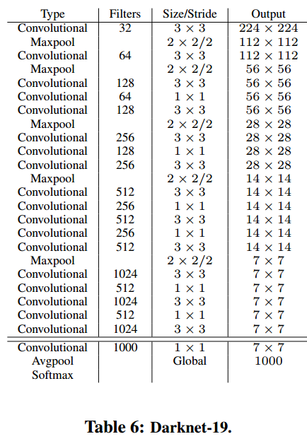

# YOLO9000: Better, Faster, Stronger
## Introduction
- Better
    - YOLO v1 보다 개선된 사항
- Faster
    - Darknet-19를 활용한 속도 향상
- Stronger
    - 9000개의 물체 탐지

## Better
- YOLO는 localization error가 높은 편
- recall이 낮음
- 이를 개선하기 위해 다음 7가지 방법을 사용
    - Batch Normalization
        - 모든 layer에 batch norm 적용
        - 정규화 효과를 얻을 수 있음
        - overfitting 없이 dropout 제거 가능
    - High Resolution Classifier
        - ImageNet의 input size를 448x448 까지 올려 fine tune
    - Convolutional With Anchor Boxes
        - fc layer를 conv layer로 대체
        - Anchor box 적용
    - Dimension Clusters
        - IOU를 고려한 k-means cluster 사용
    - Direct location prediction
        - 모델 예측의 안정성을 위해 sigmoid 활용해 offset 범위를 0과 1 사이로 조정
    - Fine-Grained Features
        - 26x26의 feature map을 생성하는 layer를 4등분하여 하나로 결합
    - Multi-Scale Training
        - 10 batch 마다 모델 input size를 조정해 학습

## Faster

- Darknet-19
    - 19개의 conv layer와 5개의 maxpooling layer로 구성 됨
    - 2개의 3x3 conv layer 사이에 1x1 conv layer 구성(NIN)
    - global average pooling layer 사용

## Stronger
- classification 데이터와 detection 데이터를 혼합하여 모델 학습
    - WordNet기반 wordTree 구성해 multi-label 학습

## Conclusion
- 다양한 class를 구분할 수 있으면서 빠른 모델

## Reference
- [[논문 리뷰] YOLO v2 (2017) 리뷰](https://deep-learning-study.tistory.com/433)