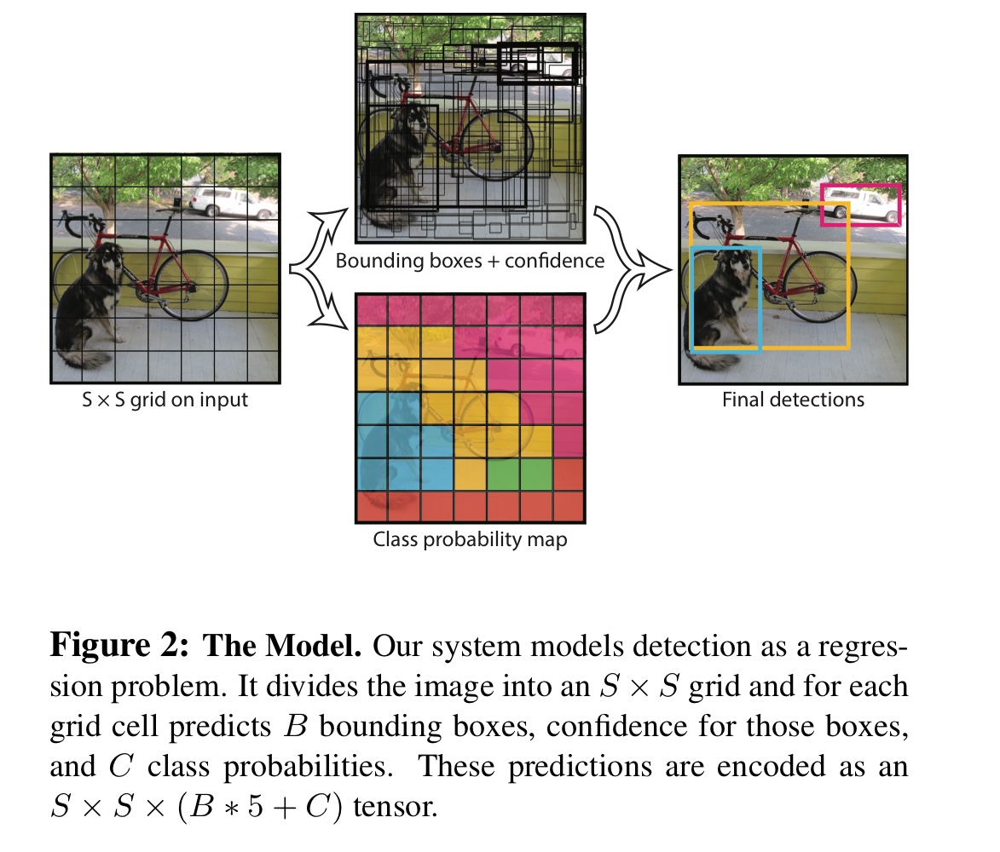

# You Only Look Once: Unified, Real-Time Object Detection
## Abstract
- object detection을 회귀 문제로 바꿔 풂
- 전체 이미지를 한 번의 평가로 bbox와 class 확률 추정
- 빠르고 다른 실시간 detector보다 정확도가 높음
- 최신 detection system보다 localization error가 높지만 false positive는 적음
- 객체에 대한 일반화된 표현을 학습

## Introduction
- 사람은 한 번 보고 이미지에서 물체가 어딨는지 확인 가능
- 현재의 detection system은 여러 과정을 거쳐 객체를 탐지
    - DPM의 경우 sliding window를 거쳐 객체 탐지
    - R-CNN의 경우 region proposal method를 통해 객체 탐지
    - 해당 모델들은 복잡한 pipeline을 사용 
        - 최적화 하기 힘들고 느림
- YOLO의 경우 객체 탐지를 단순 회귀문제로 변형해 한 번만 보고 탐지 가능
- YOLO 특징
    - 엄청 빠름
        - 단순 회귀문제로 바꿔 복잡한 pipeline이 필요 없음
    - 이미지 전체를 보고 추론함
        - sliding window와 region proposal과 달리 전체 이미지를 보고 학습 및 테스트 함
            - class에 대한 문맥 정보와 외형 정보를 학습
    - 객체에 대해 일반화된 표현 정보를 학습 함
        - 실사 이미지로 학습 하고 그림 이미지로 테스트하면 다른 모델보다 성능이 좋음 
        - 이미지에 대한 일반화 된 정보들을 학습하여 다른 영역의 이미지가 들어와도 준수한 성능을 냄
    - 빠른 속도로 물체 탐지로 최신의 기술들 보단 성능이 떨어짐
        - 특히 작은 물체를 탐지하기 힘듦

## Unified Detection
- object detection의 요소들을 single neural network로 통합
    - 전체 이미지의 feature를 이용해 모든 class에 대한 bbox를 구함
    - simple piepline으로 end-to-end 학습이 가능
    - 속도도 빠르면서 준수한 average precision 유지  
  
- YOLO model object detection 방식

- 이미지를 $S \times S$ grid로 나눔
- 객체의 중심이 grid cell에 속해있으면 grid cell이 해당 객체를 탐지
- 각 grid cell은 $B$개의 bbox와 confidence score를 예측
- object가 존재할 때 각 class 별 확률을 구함
    - $P(Class_{i}|Object)$

### Network Design

- GoogLeNet 기반 CNN 구조
    - 24개 conv layer와 2개의 fc layer로 구성
    - Inception 모듈 대신 $1\times1$ 이후 $3\times3$ conv layer사용
- Fast YOLO는 9개의 Conv Layer 사용

### Training
- 앞 20개의 layer는 ImageNet을 이용해 pretrain 하고 average pooling layer와 fc layer를 덧붙임
- 마지막 layer은 linear activation 적용 나머지는 leaky ReLU 적용
- SSE를 Loss function으로 정의
    - 문제점
        - localization error와 classification error에 동일한 가중치를 줌
        - 배경 cell이 많아 confidence가 0인 값이 많음
- 문제를 해결하기 위해 가중치를 다르게 줌
    - localization error의 가중치를 높임

### Limitations of YOLO
- 하나의 grid cell은 하나의 class만 예측
    - 겹쳐있는 object를 잘 탐지하지 못 함
- 데이터로 부터 bbox 추출하므로 새롭거나 일반적이지 않은 종횡비는 잘 예측 못함
- 큰 BBox와 작은 BBox에 동일한 가중치를 줌
    - localization에 안 좋은 영향을 끼침

## Experiments

### Comparison to Other Real-Time Systems

- YOLO 계열의 모델이 준수한 mAP와 FPS를 챙김
- 다른 모델들은 FPS와 mAP 간의 trade-off가 존재

### VOC 2007 Error Analysis

- Fast R-CNN의 경우 Background error가 YOLO에 비해 높은 편
    - Background error 
        - 물체가 없지만 있다고 판단
    - False Positive가 높음
- YOLO의 경우 Localization error가 Fast R-CNN에 비해 높은 편

### VOC 2012 Results

- 여러 모델중 YOLO만 실시간 탐지가 가능함
- 하지만 Fast R-CNN과 YOLO를 합친 모델이 4위를 할만큼 성능도 준수

## Conclusion
- YOLO는 단순 하지만 실시간으로 작동하며 준수한 성능을 냄
- 새로운 이미지에 대한 객체 검출도 잘함

## Reference
- [논문 리뷰 - YOLO(You Only Look Once) 톺아보기](https://bkshin.tistory.com/entry/%EB%85%BC%EB%AC%B8-%EB%A6%AC%EB%B7%B0-YOLOYou-Only-Look-Once)