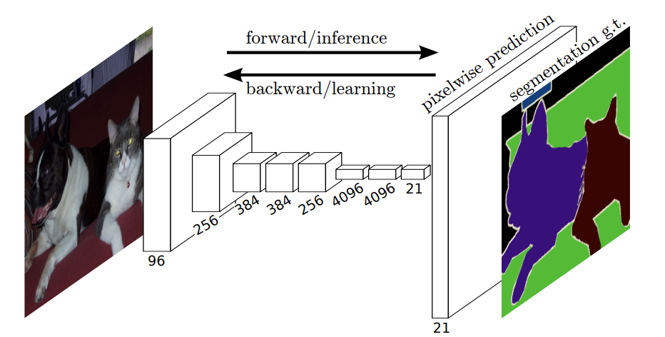
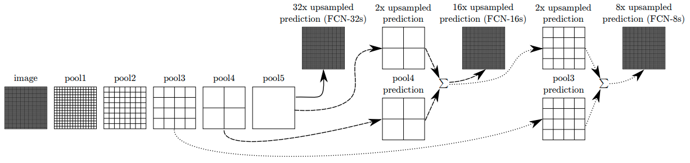

# Fully Convolutional Networks for Semantic Segmentation

## Fully convolutional networks

- FCN의 경우 fully connected layer를 conv net으로 변경
    - conv net을 사용할 경우 image에 대한 공간정보를 보존할 수 있음
    - image에 대한 object classification에 대한 확률이 아닌 heatmap 출력 가능
    - 고정된 input size를 넣지 않아도 됨
- input 이미지와 output 이미지의 크기를 맞추기 위해 upsampling 진행
    - deconvolution

- skip connection
    - FCN-숫자s : 숫자만큼 stride
    - stride를 통해 이미지에 대한 upsampling 진행
    - 각각의 값들을 합쳐 예측

## Summary
key insight
- fully convolutional network 사용
- 다양한 크기의 input 허용

FCN
- pixelwise prediction을 위해 fully convolution network 사용
- deconvolution
- skip architecture 사용

## Reference
- [Fully Convolutional Networks for Semantic Segmentation](https://gaussian37.github.io/vision-segmentation-fcn/)