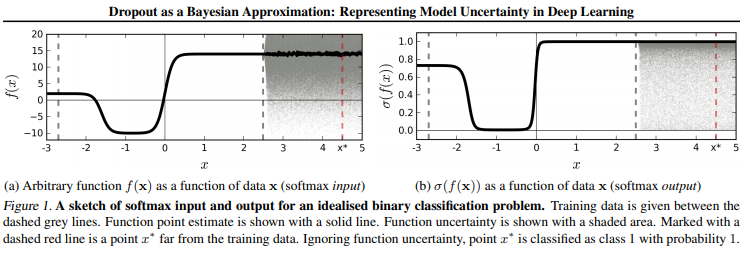

# Dropout as a Bayesian Approximation: Representing Model Uncertainty in Deep Learning
## Abstract
- Deep learning tools은 uncertainty 잡아낼 수 없음
- Bayesian model은 uncertainty 제공
    - 해당 framework는 computational cost가 엄청 남
- new theoretical framework 제안
    - dropout 사용
    - bayesian 추론을 이용해 deep Gaussian processes으로 근사

## Introduction
- 인명과 인종 차별 등과 같은 이유로 모델의 uncertainty가 중요해짐
- classification에서 잘못 된 예측을 할 수 있음 



- (a) : 데이터 $x$를 함수 $f(x)$에 넣은 값
- (b) : (a)의 값에 softmax를 취한 결과 값
    - 회색 점선 사이가 trainig data의 범위 
    - 빨간 점섬은 training data를 벗어나는 범위
    - 음영이 칠해진 곳은 uncertainty
- train 데이터를 벗어나는 input을 받았을 때 softmax의 경우 1의 값을 출력
    - uncertainty를 반영하지 못함

- 이를 해결하고자 Bayesian model로 deep learning tools를 사용
    - GP(Gaussian Process)를 이용해 Bayesian 근사 활용

```
1. GP와 dropout의 완벽한 연결을 할 수 있는 이론적인 시사점 제공
2. deep learning에서 uncertainty를 나타내는 tools 개발
```

## Dropout as a Bayesian Approximation